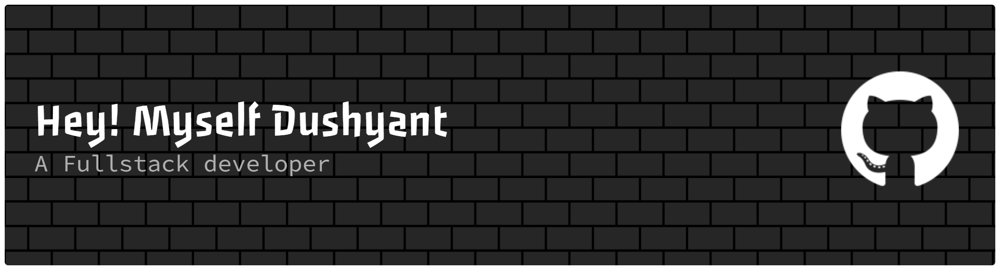

<!--
  Customize this profile README:
  - Replace YOUR_NAME, YOUR_USERNAME, YOUR_EMAIL, and all social/project links.
  - If you want the snake animation to reflect your own contribution graph,
    generate it with GitHub Actions and replace the snake image URL below.
  - Keep the widgets you want and remove anything that feels too busy.
-->

  

<h1 align="center">Dushyant Singh Sidodiya</h1>

Web Developer | Open Source Contributor | UI/UX Enthusiast

  

  
  
  

  
  

---

## About Me

I build modern, responsive interfaces with a strong focus on clarity, polish, and usability. My work lives at the intersection of open source, frontend development, and design-aware problem solving. I like contributing to community projects, improving UI details, and learning fast enough to keep up with modern web development.

  
  
  
  

---

## Tech Stack

  
  
  
  
  
  
  
  
  
  

---

## GitHub Analytics

<table align="center">
  <tr>
    <td>
      
    </td>
    <td>
      
    </td>
  </tr>
</table>

  

  

  

  

---

<!-- ## Featured Projects

<table>
  <tr>
    <td width="33%" valign="top">
      <h3 align="center">Project One</h3>
      
A premium, responsive frontend experience built for clarity, speed, and polished interactions.

      

        
        
      

      

        
        
        
      

    </td>
    <td width="33%" valign="top">
      <h3 align="center">Project Two</h3>
      
A modern UI utility, dashboard, or open-source contribution that improves the developer experience.

      

        
        
      

      

        
        
        
      

    </td>
    <td width="33%" valign="top">
      <h3 align="center">Project Three</h3>
      
A contribution-focused project designed to ship features, refine UI details, and support community growth.

      

        
        
      

      

        
        
        
      

    </td>
  </tr>
</table>

<!-- Replace the placeholders above with your real portfolio projects, live demos, and repo URLs. -->

---

## Open Source

  
  
  
  

  
  
  

---

## Connect With Me

  
  
  <!--  -->
  <!--  -->
  <!--  -->

---

<!-- ## Fun Extras

  

<table>
  <tr>
    <td width="50%" valign="top">
      <h3 align="center">Fun Fact</h3>
      
I enjoy turning small UI details into premium-feeling interfaces and learning by building things that people can actually use.

    </td>
    <td width="50%" valign="top">
      <h3 align="center">Support / Follow</h3>
      
If you like my work, follow along, star a project, or sponsor the journey.

      

        
        
      

    </td>
  </tr>
</table>

  

  

 -->

<!-- Final reminder: replace every YOUR_USERNAME, YOUR_NAME, YOUR_EMAIL, and project link before publishing. -->
