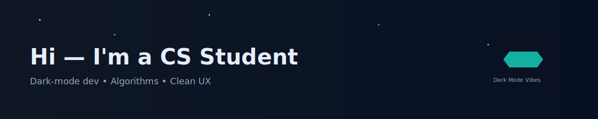

<!--
  Dark-themed GitHub Profile README
  - Replace `YOUR_NAME`, `YOUR_USERNAME`, and `your.email@example.com`
  - For live GitHub stats, set `YOUR_USERNAME` below
-->

  

  <!-- GitHub avatar: replace YOUR_USERNAME with your GitHub username or use a local path like ./assets/profile.png -->
  

<h1 align="center">Hi — I'm a CS Student</h1>

Computer Science student • Dark-theme enthusiast • Building elegant code

---

## 🔭 About Me

- I'm a Computer Science student who loves building tools, learning new algorithms, and working with dark themes.
- I care about readable code, clean UI (dark mode preferred), and efficient systems.
- Currently exploring: systems programming, algorithms, and modern web tooling.

---

## 💻 Tech & Tools

- **Languages:** Python • C++ • Java • JavaScript/TypeScript
- **Tools:** Git • Linux • VS Code (dark themes) • Docker
- **Interests:** Algorithms, OS internals, Web dev, Competitive programming

---

## 🚀 Projects

- **Project One** — short one-line description. [Repo](https://github.com/Dushyantcoder07/project-one)
- **Project Two** — short one-line description. [Repo](https://github.com/Dushyantcoder07/project-two)

Add your projects above. Keep descriptions short and link to the repos.

---

## 📊 GitHub Stats

> Replace `YOUR_USERNAME` in the image URLs below with your GitHub username to enable live stats.

<!-- Live stats (replace YOUR_USERNAME) -->

<!-- Streak: animated accent next to the streak image -->

  
  <circle cx='18' cy='18' r='7' fill='%23a7f3d0' opacity='0.95'><animate attributeName='r' values='6;10;6' dur='1.6s' repeatCount='indefinite'/></circle></svg>" style="vertical-align:middle;margin-left:8px;" />

<!-- Action buttons (badges act as clickable buttons) -->

  
  

<!-- A small animated accent (uses an SVG data URL) -->

  <circle class='dot' cx='10' cy='9' r='6'/><text x='24' y='13' font-family='Inter, Arial' font-size='12' fill='%23cbd5e1'>Dark mode friendly</text></svg>" />

---

## Contact

- GitHub: https://github.com/Dushyantcoder07

---

## 🎧 Theme

I code best in dark mode. Favorite theme: Dracula / Night Owl.

---

If you'd like, I can:

- add polished badges (shields) and a dynamic banner
- generate a cool animated GIF header or SVG dark banner
- auto-insert your real GitHub username and email

<!--
  Tips:
  - To enable stats, replace `YOUR_USERNAME` with your GitHub username.
  - Replace placeholders for name/email and link your top projects.
-->
